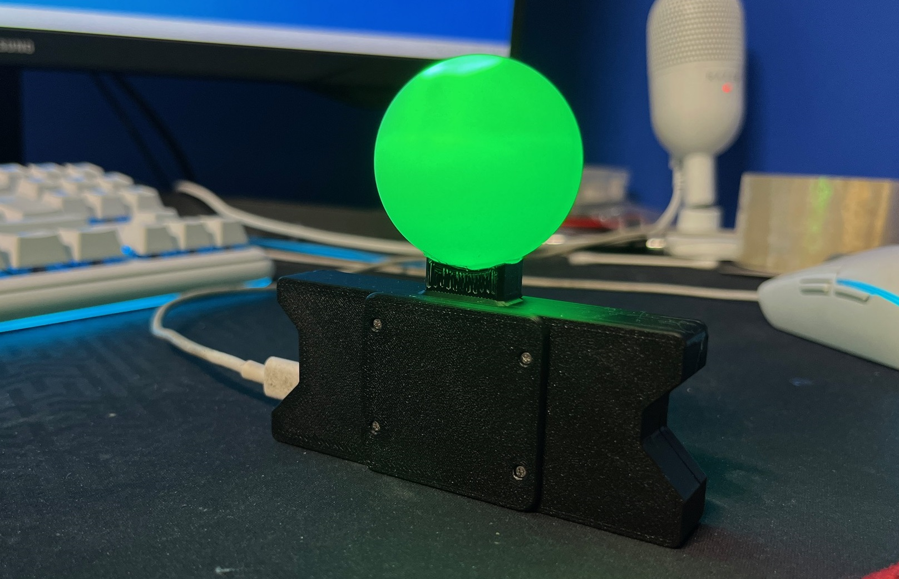

Official HadesVR Discord [feel free to join.](https://discord.gg/h2SFGEbuRH)

# HadesVR Remix
HadesVR Remix is a SteamVR compatible VR setup based on original HadesVR. 

My Remixed version aims for more "streamlined" HadesVR experience.

The setup includes DIY Headset and Controllers that emulate HTC vive wands. You can also build the receiver only if you wish to use HadesVR controllers with your pre-existing headset.

HadesVR driver also uses [PSMoveServiceEX](https://github.com/Timocop/PSMoveServiceEx) for the positional tracking of Headset and Controllers, using ping pong balls and different colours of LEDs.

For more information on *everything*, check out the [docs](docs/DocsIndex.md)!

# How does it work and what can it do?

The headset connects to the PC via USB and receives rotation and button data from both controllers wirelessly, while the tracking is done outside-in using Playstation Move Cameras and [PSMoveServiceEX](https://github.com/psmoveservice/PSMoveService).

You can use the setup in: 
* Headset and controllers mode - Headset + Controllers + PSMoveServiceEX Tracking - 6DoF
* Headset only mode - Headset + PSMoveServiceEX - 6DoF
* Headset only mode - Headset - 3DoF
* Controllers only mode - Controllers + [Receiver](docs/RFReceiver.md) - 6DoF

# Custom hardware

As of right now the custom hardware available is:

* [HadesVR Basic HMD PCB](https://github.com/ManoloMancelli/HadesVR_Remix/tree/main/Hardware/HMD%20PCB) 
* [HadesVR Wand Controllers](https://github.com/HadesVR/Wand-Controller)

# Patreon
If you'd like to support me, consider subscribing to my [Patreon](https://www.patreon.com/Manollo)