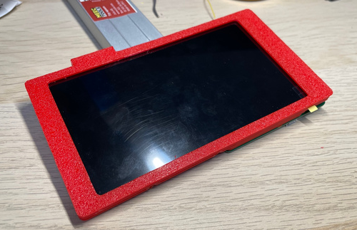
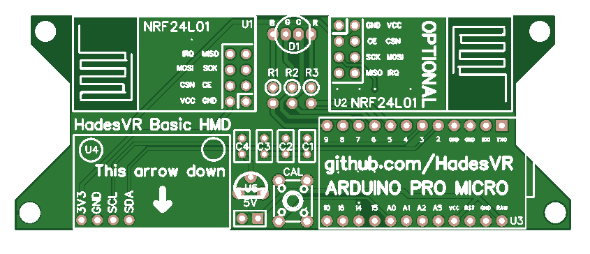

# Headset

The headset connects directly to your PC using the USB cable.
Built-in HadesVR PCB provides rotation data from gyroscope and also receives the controller data wirelessly.

# Hardware Needed

## Shell
HadesVR Remix uses fully 3D printed shell for the headset.

⚠️ The screen mount depends on what screen and case you use.

## Electronics

* Arduino Pro micro - Best one. Different ones won't work.

* Gyroscope - MPU9250 is the best one but you can use cheaper ones at your own risk.

* NRF24L01 - Wireless receiver for the Controllers communication

* 5v to 3.3v voltage regulator to power the NRF24 module

* Super bright RGB LED

* White PingPong ball (Vase-mode 3D printed works but it's fragile)

## Display

You can find these screens on Aliexpress, but make sure you are buying the whole kit, display + driver board.

### LS055R1SX04 with Green board

With this option you'll have to purchase the [display](https://www.aliexpress.com/item/4000999801804.html) and [board](https://www.aliexpress.com/item/1005002330323719.html) separately. Make sure you choose the right display to go with the right board (LS055R1SX04 lcd won't work with LS055R1SX03 board) and make sure the display has a backlight before purchasing since these are usually used for resin 3d printers.

These screens are 1440x2560(vertical), they officially support up to 60Hz but with the board linked below they can be pushed to around 72hz without artifacts.

The board is meant to run the display at 60hz but it can easily do 72hz if you create a custom resolution in nvidia control panel or amd's driver settings thing.

# HMD Circuit schematic

Get the gerber files [Here](https://github.com/ManoloMancelli/HadesVR_Remix/tree/main/Hardware/HMD%20PCB/Gerber%20Files)

HMD PCB works only with Arduino Pro Micro. Any other board is not supported.

You can use only one NRF24L01 module but it's best to use two of them.

Board works with MPU6500 but it's generally better to get a better one like MPU9250.

You don't need to use the 5V pins. Board is powered by Pro Micro which connects with your PC with USB cable.

If you don't want to use this board with display, you can grab the case [Here](https://github.com/ManoloMancelli/HadesVR_Remix/tree/main/Hardware/HMD%20PCB/3D%20Print/HMD%20PCB%20Case%20-%20Without%20Display)

## ⚠️ IMPORTANT: YOU NEED A 5V TO 3.3V REGULATOR TO POWER THE NRF24 MODULE, ***THE PRO MICRO DOES NOT SUPPLY 3.3V ON ANY OF ITS PINS*** 
# Uploading the firmware

To upload the firmware you will need to have the [FastIMU](https://github.com/LiquidCGS/FastIMU) (also available on the Arduino library manager) and the [RF24 Arduino Library](https://github.com/nRF24/RF24) installed in your [Arduino IDE](https://www.arduino.cc/en/software). 

You can download the required library using the Libraries manager from within the Arduino IDE. The rest of the used libaries are already included in the firmware folder.

The steps to upload the firmware are as follows:

* Open Firmware.ino inside the Software/Firmware/Headset folder
* Select "Arduino Leonardo" as the board
* Select the correct COM port for the board
* Press the Upload button

# Getting HID values

To configure the driver you will need the VID and PID values from the board you're using. The easiest way of getting them is going to the Arduino IDE, clicking on tools and clicking on get board info with the HMD plugged in:

Do note these values are in HEX so to use them in the driver config file you'll need to convert them to decimal numbers.
to do that you can use websites like [Rapidtables](https://www.rapidtables.com/convert/number/hex-to-decimal.html), just input your VID and PID values one at a time and convert them to decimal numbers.

Once done, you'll get values like these and then all you have to do is load them up in your driver config file. For more details on driver configuration, check out the [driver configuration docs](Driver.md#driver-configuration)

