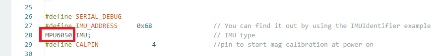
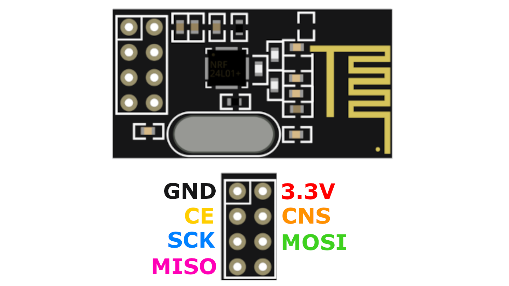

# Official HadesVR Wand Controller

These controllers aim to simulate the original Vive wand controllers. This build uses custom-ordered Wand PCB and off-the-shelf components.

# Hardware Setup

1. Order [Wand PCB](https://github.com/ManoloMancelli/HadesVR_Remix/blob/main/Hardware/Wand%20Controllers/Hades%20VR%20Wand%20-%20Original%20Board.zip)

2. Buy Arduino Pro Mini 3.3V 8mHz - Make sure it looks like the one below - Very important!

# Environment Setup

This guide assumes you have fresh Windows installation on your PC. Anything you have installed previously, might have an impact on this project.

1. Install all of the Windows Updates.

2. Download and install the [CH340 Driver](https://cdn.sparkfun.com/assets/learn_tutorials/8/4/4/CH341SER.EXE)

3. Download [Arduino IDE](https://www.arduino.cc/en/software/)

4. Download [7Zip](https://www.7-zip.org/download.html)

5. Install FastIMU library inside Arduino.

6. Install RF24 library inside Arduino.

7. Download [Wand Firmware](https://github.com/ManoloMancelli/HadesVR_Remix/tree/main/Software/Firmware%20-%20For%20the%20boards/Official%20HadesVR%20Wand%20-%20Untested)

8. Unpack the Firmware onto your desktop

9. Install [Steam](https://store.steampowered.com/tags/en/Download)

10. Install [SteamVR](https://store.steampowered.com/app/250820/SteamVR/)

11. Install [HadesVR Driver](Driver.md)

# Soldering PCB

1. Solder goldpins to your Arduino Pro Mini

2. Solder goldpins to your PCB

# Soldering Gyroscope (IMU)

1. Unplug your Arduino Uno from computer.

2. Prepare 4 short wires (I use Kynar)

3. Solder wires to your MPU board like below.

4. Solder IMU with wires to your Arduino UNO

5. You should now have something like this

6. Connect your Arduino Uno to PC and change the imu type to yours

You can find the IMU type directly on the chip

7. Upload the Firmware to your Arduino Uno

8. Open Serial Monitor again. It should now show you this:

This means that the Gyroscope is working and you can proceed to the next steps.

# Soldering NRF24 (Wireless Transceiver)

1. (optional) Remove the goldpins from your NRF24 board.

2. Prepare 7 wires (I use Kynar)

3. Solder the wires to your NRF24 board

4. Solder the NRF24 to your Arduino UNO

You should now have something like this

5. Connect your Arduino Uno to PC and open the Serial Monitor again.

You should now see this

This means that now both NRF24 module and Gyroscope are working and you can continue to next steps.

# Soldering LED

1. Prepare one, blue LED

2. Solder the longer pin to the 5V pin of the Arduino Uno

3. Solder the shorter pin to the GND pin of the Arduino Uno

LED should now light up when you connect the Arduino to PC

You can now proceed to the next steps

# Soldering Buttons

1. Prepare 3 Tact Switch buttons

2. Solder one wire at each end of the Tact Switch. Repeat for all three.

3. Twist three wires from one end with each other like this

4. Glue the switches to a piece of cardboard and mark them down like this

5. Connect the Tact Switches to your Arduino Uno

You should now have something like this

You can now proceed with the next steps

# Soldering Joystick

1. Prepare your joystick. Best to use this one

2. (Optional) remove goldpin connector

3. Prepare 5 pieces of wire

4. Solder wires to each pin of the Joystick board

5. Connect the Joystick to your Arduino Uno

You should now have something like this

You can now proceed to next steps

# Gyroscope Calibration

1. Connect your board to PC and open Serial Monitor again.

2. Press and hold the SYS and MENU buttons

3. While holding both buttons, push built-in reset button on your Arduino Uno.

Board should now go into calibration

4. Wait couple of seconds for EEPROM writing

Now the Wand controller is ready to go

You can glue everything on a flat piece of cardboard so that nothing moves

# Troubleshooting

1. Wand works but is detected as Knuckle

 - Make sure that you have correct controller type set in HadesVR driver config

2. Components got too hot and unglued from the cardboard

 - Lol

3. Grip button logic is reversed. It's pressed when I don't press it and vice-versa.

 - You have installed "Normally Open" tact switch. Replace it with "Normally closed" one.

4. In-game Wand model looks like hand

 - There are no custom models at this point. You are stuck with generic hand model.

5. Rotation is working but controller doesn't move when I wave my hand

 - Wand controller requires PSMoveService EX and PSEye / HadesVR Base Stations to work in 6DoF

6. Joystick is not working properly

 - Make sure you changed the joystick values

7. SteamVR shows low controller battery

 - At this moment, there is no battery measurement system. Just ignore it.

