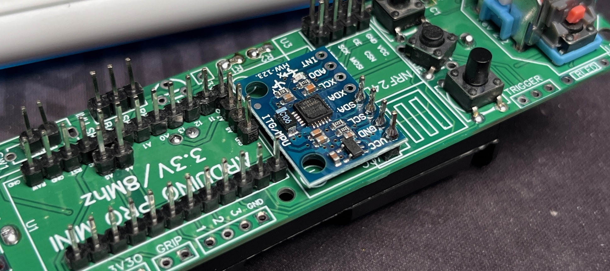
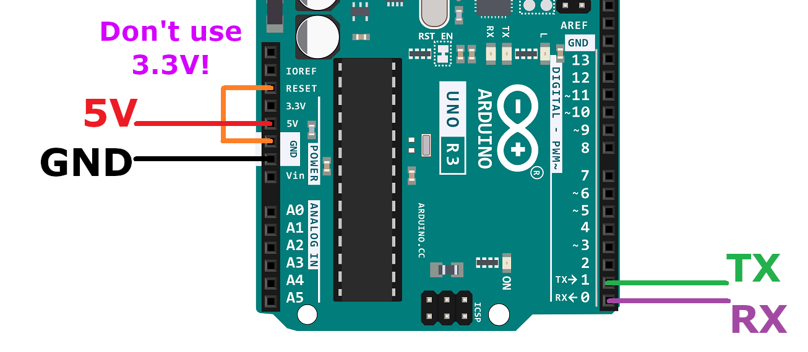
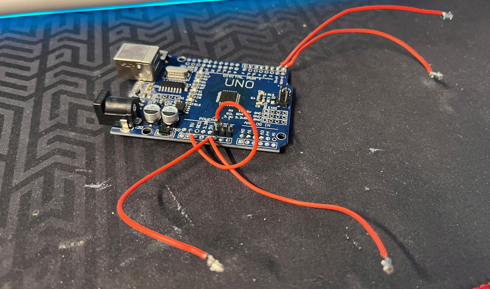

# Official HadesVR Wand Controller

These controllers aim to simulate the original Vive wand controllers. This build uses custom-ordered Wand PCB and off-the-shelf components.

# Hardware Setup

1. Order [Wand PCB](https://github.com/ManoloMancelli/HadesVR_Remix/blob/main/Hardware/Wand%20Controllers/Hades%20VR%20Wand%20-%20Original%20Board.zip)

2. Buy Arduino Pro Mini 3.3V 8mHz - Make sure it looks like the one below - Very important!

3. Buy one 18650 cell and cell holder

# Environment Setup

This guide assumes you have fresh Windows installation on your PC. Anything you have installed previously, might have an impact on this project.

1. Install all of the Windows Updates.

2. Download and install the [CH340 Driver](https://cdn.sparkfun.com/assets/learn_tutorials/8/4/4/CH341SER.EXE)

3. Download [Arduino IDE](https://www.arduino.cc/en/software/)

4. Download [7Zip](https://www.7-zip.org/download.html)

5. Install FastIMU library inside Arduino.

6. Install RF24 library inside Arduino.

7. Download [Wand Firmware](https://github.com/ManoloMancelli/HadesVR_Remix/tree/main/Software/Firmware%20-%20For%20the%20boards/Official%20HadesVR%20Wand%20-%20Untested)

8. Unpack the Firmware onto your desktop

9. Install [Steam](https://store.steampowered.com/tags/en/Download)

10. Install [SteamVR](https://store.steampowered.com/app/250820/SteamVR/)

11. Install [HadesVR Driver](Driver.md)

# PCB Assembly

1. Solder goldpins to your Arduino Pro Mini

2. Solder goldpins to your PCB

3. Solder buttons to your PCB

4. Solder joystick to your PCB

5. Glue the cell holder to PCB and solder the voltage wires

6. Solder the Red LED and 68 Ohm resistor. Longer pin of LED goes towards the top of the board. Resistor polarity doesn't matter. You can solder it either way.

7. Solder the 470nF capacitor - C1. I've used the 0402 SMD version.

8. Solder the 3.3k resistor - R2 and 1k resistor - R1. I've used the 0402 SMD version.

9. Solder the Gyroscope (MPU) on top of the goldpins. Make sure it's parallel and as close to the PCB as possible.

10. Solder the Arduino Pro Mini on top of the goldpins. Make sure it's higher than Gyroscope (MPU) and it's not touching it.

11. Shorten the Gyroscope (Mpu) goldpins with tweezers

12. Solder the NRF24 module on top of the goldpins. Make sure it's higher than Gyroscope (MPU) and it's not touching it

13. Solder a piece of wire between Gyroscope (MPU) capactior and 3V3 pin

14. Place a jumper on top of SRC and BAT goldpin. I don't have any jumpers right now so I will use a piece of wire instead.

15. Solder the TP4056 module using goldpin pieces

16. Spray whole board with IPA

17. Brush entire board with toothbrush. Don't use the one for your teeth lol. Semi-hard brush works the best. This will remove any flux from the PCB

18. Put the plastic part on top of your joystick

19. Put the 18650 cell into the plastic holder. Make sure to put it in correctly! + goes to + and - goes to -

20. Connect the USB cable to TP4056 and charge the battery. Red light means that the battery is charging. When it's fully charged, green light will be lit.

# Firmware Preparation

1. Unzip the Firmware onto your desktop

2. Open "Firmware.ino"

3. Change the Gyroscope (IMU) type to the one you used

You can check what type it is directly on your board

4. Define whenever this is Right or Left controller

5. Define the Battery and Joystick values

Now the Firmware is ready and you can proceed to next steps

# Firmware Flashing

For this part I will be using separate, Arduino Uno board. You can also use the USBasp programmer but it's far easier to do it with Arduino Uno.

1. Prepare 5 pieces of wire

2. Open Arduino IDE on your PC and connect Arduino Uno with USB.

3. Select Arduino Uno and correct port.

4. Create a new, empty sketch

5. Upload the sketch to your Arduino Uno

6. Solder the wires to your Arduino Uno board

You should now have something like this

7. Unplug the Arduino Uno from your PC

8. Connect the Arduino Uno with wires to your Arduino Pro Mini

# Gyroscope Calibration

1. Connect your board to PC and open Serial Monitor again.

2. Press and hold the SYS and MENU buttons

3. While holding both buttons, push built-in reset button on your Arduino Uno.

Board should now go into calibration

4. Wait couple of seconds for EEPROM writing

Now the Wand controller is ready to go

You can glue everything on a flat piece of cardboard so that nothing moves

# Troubleshooting

1. Wand works but is detected as Knuckle

 - Make sure that you have correct controller type set in HadesVR driver config

2. Components got too hot and unglued from the cardboard

 - Lol

3. Grip button logic is reversed. It's pressed when I don't press it and vice-versa.

 - You have installed "Normally Open" tact switch. Replace it with "Normally closed" one.

4. In-game Wand model looks like hand

 - There are no custom models at this point. You are stuck with generic hand model.

5. Rotation is working but controller doesn't move when I wave my hand

 - Wand controller requires PSMoveService EX and PSEye / HadesVR Base Stations to work in 6DoF

6. Joystick is not working properly

 - Make sure you changed the joystick values

7. SteamVR shows low controller battery

 - At this moment, there is no battery measurement system. Just ignore it.

