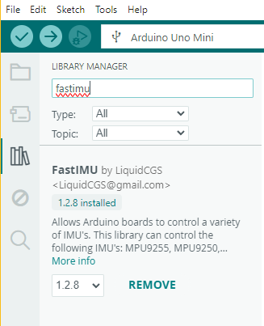
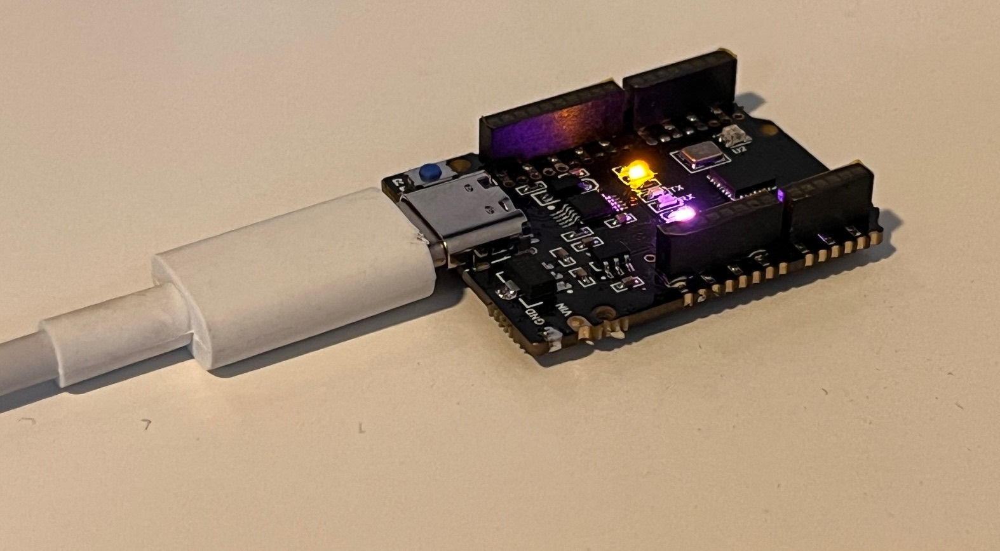
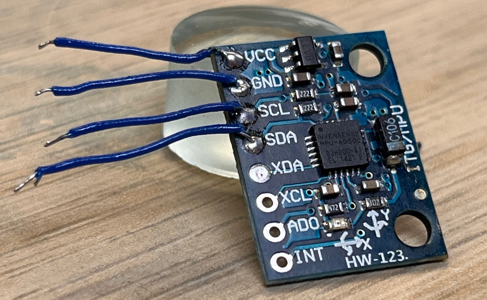

# Arduino Uno Wand Controllers

These controllers aim to simulate the original Vive wand controllers, they're easier to build option to the Knuckles ones but they're lacking the finger tracking aspect.
These controllers support analog trigger though it's not enabled by default, to allow for it you just need to change a couple lines of code. They also have battery % monitoring but you need to calibrate that on your own and tends to not be super accurate.

# Environment Setup

This guide assumes you have fresh Windows installation on your PC. Anything you have installed previously, might have an impact on this project.

1. Install all of the Windows Updates.

2. Download and install the [CH340 Driver](https://cdn.sparkfun.com/assets/learn_tutorials/8/4/4/CH341SER.EXE)

3. Download [Arduino IDE](https://www.arduino.cc/en/software/)

4. Download [7Zip](https://www.7-zip.org/download.html)

5. Install FastIMU library inside Arduino.

6. Install RF24 library inside Arduino.

7. Download [Wand Firmware](https://github.com/ManoloMancelli/HadesVR_Remix/tree/main/Software/Firmware%20-%20For%20the%20boards/Controller_HTC%20-%20Untested)

8. Unpack the Firmware onto your desktop

# First Sanity Check

1. Open "Left_controller_Filter.ino" or "Right_controller_Filter.ino" - Depends on which one you downloaded.

2. Connect your Arduino Uno to PC with USB cable. (I'm using Uno Mini which is the same as regular one)

3. Install all of the Drivers that Arduino pops-up

4. Select correct board and COM port.

5. Upload Wand Firmware to your Arduino board.

6. Open Serial Monitor and check if there are any messages. It should show you IMU Error like below.

If you get this error, it means that Firmware is working and you can now proceed to the next steps.

# Soldering Gyroscope (IMU)

1. Unplug your Arduino Uno from computer.

2. Prepare 4 short wires (I use Kynar)

3. Solder wires to your MPU board like below.

4. Solder IMU with wires to your Arduino UNO

5. You should now have something like this

6. Connect your Arduino Uno to PC and change the imu type to yours

## Hardware needed per controller is as follows:
| Component | Purpose | Notes | Amount |
| --------- | ----------- | ----- | ------ |
| Arduino Nano/UNO/Pro Mini* | The brains of the controller | keep in mind you'll need a serial programmer if you're using a Pro Mini | 1 |
| MPU9250*   | Used to gather rotation data | Orientation of the IMU matters so keep that in mind. | 1 | 
| NRF24L01  | Used to transmit the controller data over to the HMD | You *will* need a 3.3v regulator if you're using a Pro Mini | 1 | 
| 5mm Red or Blue LED | Used for 6dof tracking | Each controller/headset has to have a different color: For example Green HMD, Red Left controller, Blue Right controller. | 1 |
| Tact switches | You'll be using these as your Trigger, grip, menu and system buttons | You can use Rubber dome switches, those are a lot more comfortable than the hard plastic ones. | 4 |
| Resistor for the LED | Used to limit the current for the tracking LED | It's value depends on the color of the LED and the voltage you're using. | 1 |
| Any lithium battery | Will power the controller so I recommend 18650s | avoid Ultrafire batteries at all cost they lie about their capacity. | 1 |
| TP4056 Battery charger with protection | Is in charge of charging and protecting your battery | Remember to set the charging current to 0.5c to be safe. | 1 |
| 5v step up converter | To power the Arduino | Needed unless you've got a 3.3v arduino, then you'll need a 3.3v ldo regulator like the HT7533 or MCP1700-3.3| 1 |
| ON-OFf Switch | To turn on or off the controllers | Goes between the output positive of the tp4056 board and the step up converter/regulator.| 1 |
| Analog stick module with button | Your main Analog stick | any will do really, if yours doesn't have a button you'll need an extra tact switch to simulate trackpad click. | 1 |
| White ping pong ball | Used to difuse the LED's light for 6dof tracking | Any will do as long as it's white and 40mm in diameter | 1 |

*can use any (preferrably) 9dof IMU but you'll need to modify the code a bit to allow for that.

## Controller pinouts are the following:

Battery level monitoring is done using a 1k-3.3k resistor divider if you're using a 3.3v arduino. If you're using a 5v arduino with a step up converter you can connect the battery + terminal directly to the A0 analog pin.
A0 can also be left floating if battery level monitoring is not desired.

Digital pins all have internal pull up resistors programmed so all you have to do is put the switch between the pin and GND.